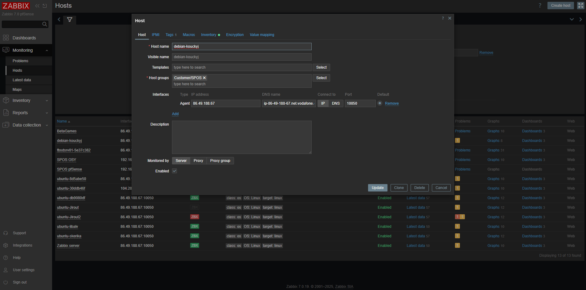

Jediné co jsem změnil ve Vagrantfile bylo přidání dalších dvou scriptů pro instalaci a konfiguraci zabbix agenta.

V instalace funguje takto:
# Aktualizace seznamu balíčků a instalace základních nástrojů potřebných pro další kroky
sudo apt-get update
sudo apt-get install -y wget gnupg net-tools

# Stažení a instalace oficiálního Zabbix repozitáře pro Debian 11 (Bullseye)
wget https://repo.zabbix.com/zabbix/7.0/debian/pool/main/z/zabbix-release/zabbix-release_latest_7.0+debian11_all.deb
sudo dpkg -i zabbix-release_latest_7.0+debian11_all.deb

# Aktualizace seznamu balíčků po přidání nového repozitáře
sudo apt-get update

# Instalace Zabbix Agent2 verze 7.0 LTS včetně všech dostupných pluginů
sudo apt-get install -y zabbix-agent2 zabbix-agent2-plugin-*

# Povolení služby Zabbix Agent2 pro automatické spouštění při startu systému
sudo systemctl enable zabbix-agent2

# Restart služby Zabbix Agent2, aby se načetla aktuální konfigurace
sudo systemctl restart zabbix-agent2

A konfigurace takto: 
#!/usr/bin/env bash

# Definice unikátního jména hosta a jeho zkrácené varianty
UNIQUE_HOSTNAME="debian-kouckyj"
SHORT_HOSTNAME=$(echo "$UNIQUE_HOSTNAME" | cut -d'-' -f1,2)

# Vytvoření zálohy původního konfiguračního souboru Zabbix Agent2
sudo cp -v /etc/zabbix/zabbix_agent2.conf /etc/zabbix/zabbix_agent2.conf-orig

# Nastavení parametru Hostname – přepíše existující řádek nebo jej přidá na konec
sudo sed -i "/^Hostname=/c\Hostname=$SHORT_HOSTNAME" /etc/zabbix/zabbix_agent2.conf
grep -q "^Hostname=" /etc/zabbix/zabbix_agent2.conf || echo "Hostname=$SHORT_HOSTNAME" | sudo tee -a /etc/zabbix/zabbix_agent2.conf

# Nastavení parametru Server – adresa Zabbix serveru
sudo sed -i "/^Server=/c\Server=enceladus.pfsense.cz" /etc/zabbix/zabbix_agent2.conf
grep -q "^Server=" /etc/zabbix/zabbix_agent2.conf || echo "Server=enceladus.pfsense.cz" | sudo tee -a /etc/zabbix/zabbix_agent2.conf

# Nastavení parametru ServerActive – adresa aktivního serveru
sudo sed -i "/^ServerActive=/c\ServerActive=enceladus.pfsense.cz" /etc/zabbix/zabbix_agent2.conf
grep -q "^ServerActive=" /etc/zabbix/zabbix_agent2.conf || echo "ServerActive=enceladus.pfsense.cz" | sudo tee -a /etc/zabbix/zabbix_agent2.conf

# Úprava parametru Timeout – prodloužení časového limitu na 30 sekund
sudo sed -i "/^Timeout=/c\Timeout=30" /etc/zabbix/zabbix_agent2.conf
grep -q "^Timeout=" /etc/zabbix/zabbix_agent2.conf || echo "Timeout=30" | sudo tee -a /etc/zabbix/zabbix_agent2.conf

# Nastavení parametru HostMetadata – metadata pro auto-registraci hosta
sudo sed -i "/^HostMetadata=/c\HostMetadata=SPOS" /etc/zabbix/zabbix_agent2.conf
grep -q "^HostMetadata=" /etc/zabbix/zabbix_agent2.conf || echo "HostMetadata=SPOS" | sudo tee -a /etc/zabbix/zabbix_agent2.conf

# Zobrazení rozdílů mezi původním a upraveným konfiguračním souborem
sudo diff -u /etc/zabbix/zabbix_agent2.conf-orig /etc/zabbix/zabbix_agent2.conf

# Restart služby Zabbix Agent2, aby se načetla nová konfigurace
sudo systemctl restart zabbix-agent2

